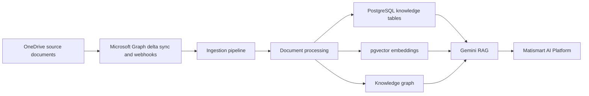

# Matismart DataHub Lineage

## Source of truth

OneDrive is the source of truth. DataHub must not be used as the canonical storage location for documents or document content. It catalogs metadata, lineage, governance state, and discoverability signals.

## Lineage chain

## Required provenance

Every AI answer must retain:

- tenant id
- project id
- canonical document id
- document version id
- chunk id
- source OneDrive drive item id
- source checksum
- approval state
- citation text range or page anchor where available

